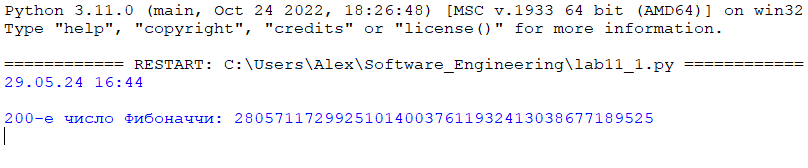
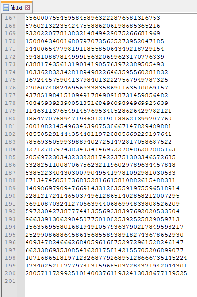

# Тема 11. Итераторы и генераторы
Отчет по Теме #11 выполнил:
- Глазырин Александр Сергеевич
- ИНО ОЗБ ПОАС-22-1

| Задание   | Сам_раб |
|-----------|---------|
| Задание 1 | +       |
| Задание 2 | +       |

знак "+" - задание выполнено; знак "-" - задание не выполнено;

Работу проверили:
- к.э.н., доцент Панов М.А.

## Самостоятельная работа 1
### Вас никак не могут оставить числа Фибоначчи, очень уж они вас заинтересовали. Изучив новые возможности Python вы решили реализовать программу, которая считает числа Фибоначчи при помощи итераторов. Расчет начинается с чисел 1 и 1. Создайте функцию fib(n), генерирующую n чисел Фибоначчи с минимальными затратами ресурсов. Для реализации этой функции потребуется обратиться к инструкции yield (Она не сохраняет в оперативной памяти огромную последовательность, а дает возможность “доставать” промежуточные результаты по одному). Результатом решения задачи будет листинг кода и вывод в консоль с числом Фибоначчи от 200.

```python
from get_datetime import get_datetime

get_datetime()

def fib(n):
    a, b = 1, 1
    for _ in range(n):
        yield a
        a, b = b, a + b

fib_generator = fib(200)
fibonacci_200 = list(fib_generator)[-1]
print("200-е число Фибоначчи:", fibonacci_200)
```

### Результат


## Самостоятельная работа 2
### К коду предыдущей задачи добавьте запоминание каждого числа Фибоначчи в файл “fib.txt”, при этом каждое число должно находиться на отдельной строчке. Результатом выполнения задачи будет листинг кода и скриншот получившегося файла

```python
from get_datetime import get_datetime

get_datetime()

def fib(n, filename='fib.txt'):
    a, b = 1, 1
    with open(filename, 'w') as file:
        for _ in range(n):
            file.write(f"{a}\n")
            yield a
            a, b = b, a + b

fib_generator = fib(200)
list(fib_generator)
```

### Результат

