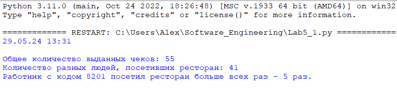
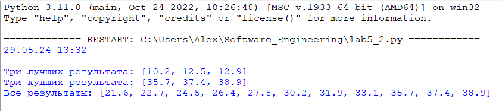
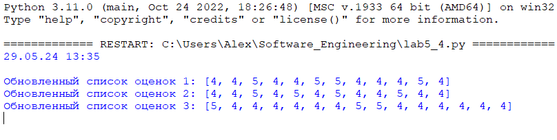
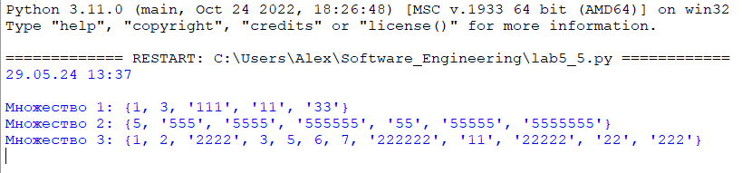

# Тема 5. Базовые коллекции: множества, списки
Отчет по Теме #5 выполнил:
- Глазырин Александр Сергеевич
- ИНО ОЗБ ПОАС-22-1

| Задание    | Сам_раб |
|------------|---------|
| Задание 1  | +       |
| Задание 2  | +       |
| Задание 3  | +       |
| Задание 4  | +       |
| Задание 5  | +       |

знак "+" - задание выполнено; знак "-" - задание не выполнено;

Работу проверили:
- к.э.н., доцент Панов М.А.

## Самостоятельная работа №1
### Ресторан на предприятии ведет учет посещений за неделю при помощи кода работника. У них есть список со всеми посещениями за неделю. Ваша задача почитать: 
* Сколько было выдано чеков
* Сколько разных людей посетило ресторан
* Какой работник посетил ресторан больше всех раз
### Список выданных чеков за неделю:
### [8734, 2345, 8201, 6621, 9999, 1234, 5678, 8201, 8888, 4321, 3365,  1478, 9865, 5555, 7777, 9998, 1111, 2222, 3333, 4444, 5556, 6666,  5410, 7778, 8889, 4445, 1439, 9604, 8201, 3365, 7502, 3016, 4928,  5837, 8201, 2643, 5017, 9682, 8530, 3250, 7193, 9051, 4506, 1987,  3365, 5410, 7168, 7777, 9865, 5678, 8201, 4445, 3016, 4506, 4506]
### Результатом выполнения задачи будет: листинг кода, и вывод в консоль, в котором будет указана вся необходимая информация.

```python
visits = [8734, 2345, 8201, 6621, 9999, 1234, 5678, 8201, 8888, 4321, 3365, 1478, 9865, 5555,
          7777, 9998, 1111, 2222, 3333, 4444, 5556, 6666, 5410, 7778, 8889, 4445, 1439, 9604,
          8201, 3365, 7502, 3016, 4928, 5837, 8201, 2643, 5017, 9682, 8530, 3250, 7193, 9051,
          4506, 1987, 3365, 5410, 7168, 7777, 9865, 5678, 8201, 4445, 3016, 4506, 4506]

total_checks = len(visits)

unique_visitors = len(set(visits))

from collections import Counter
visitor_count = Counter(visits)
most_frequent_visitor = visitor_count.most_common(1)[0]

print("Общее количество выданных чеков:", total_checks)
print("Количество разных людей, посетивших ресторан:", unique_visitors)
print("Работник с кодом", most_frequent_visitor[0], "посетил ресторан больше всех раз -", most_frequent_visitor[1], "раз.")
```
### Результат


## Самостоятельная работа №2
### На физкультуре студенты сдавали бег, у преподавателя физкультуры есть список всех результатов, ему нужно узнать
* Три лучшие результата
* Три худшие результата
* Все результаты начиная с 10
### Ваша задача помочь ему в этом. Список результатов бега:
### [10.2, 14.8, 19.3, 22.7, 12.5, 33.1, 38.9, 21.6, 26.4, 17.1, 30.2, 35.7, 16.9, 27.8, 24.5, 16.3, 18.7, 31.9, 12.9, 37.4]
### Результатом выполнения задачи будет: листинг кода, и вывод в консоль, в котором будет указана вся необходимая информация.

```python
results = [10.2, 14.8, 19.3, 22.7, 12.5, 33.1, 38.9, 21.6, 26.4, 17.1, 30.2, 35.7, 16.9, 27.8, 24.5, 16.3, 18.7, 31.9, 12.9, 37.4]
sorted_results = sorted(results)
top_three = sorted_results[:3]
worst_three = sorted_results[-3:]
from_tenth = sorted_results[9:]
print("Три лучших результата:", top_three)
print("Три худших результата:", worst_three)
print("Все результаты:", from_tenth)
```
### Результат


## Самостоятельная работа №3
### Преподаватель по математике придумал странную задачку. У вас есть три списка с элементами, каждый элемент которых – длина стороны треугольника, ваша задача найти площади двух треугольников, составленные из максимальных и минимальных элементов полученных списков. Результатом выполнения задачи будет: листинг кода, и вывод в консоль, в котором будут указаны два этих значения.
### Три списка:
### one = [12, 25, 3, 48, 71]
### two = [5, 18, 40, 62, 98]
### three = [4, 21, 37, 56, 84]

```python
import math

def heron_area(a, b, c):
    p = (a + b + c) / 2
    return math.sqrt(p * (p - a) * (p - b) * (p - c))

one = [12, 25, 3, 48, 71]
two = [5, 18, 40, 62, 98]
three = [4, 21, 37, 56, 84]

max_a = max(one)
max_b = max(two)
max_c = max(three)

min_a = min(one)
min_b = min(two)
min_c = min(three)

area_max = heron_area(max_a, max_b, max_c)
area_min = heron_area(min_a, min_b, min_c)

print("Площадь треугольника из максимальных сторон:", area_max)
print("Площадь треугольника из минимальных сторон:", area_min)

```
### Результат


## Самостоятельная работа №4
### Никто не любит получать плохие оценки, поэтому Борис решил это исправить. Допустим, что все оценки студента за семестр хранятся в одном списке. Ваша задача удалить из этого списка все двойки, а все тройки заменить на четверки.
### Списки оценок (проверить работу программы на всех трех вариантах):
### [2, 3, 4, 5, 3, 4, 5, 2, 2, 5, 3, 4, 3, 5, 4]
### [4, 2, 3, 5, 3, 5, 4, 2, 2, 5, 4, 3, 5, 3, 4]
### [5, 4, 3, 3, 4, 3, 3, 5, 5, 3, 3, 3, 3, 4, 4]
### Результатом выполнения задачи будет: листинг кода, и вывод в консоль, в котором будут три обновленных массива.

```python
def improve_grades(grades):
    return [4 if grade == 3 else grade for grade in grades if grade != 2]

grades_list1 = [2, 3, 4, 5, 3, 4, 5, 2, 2, 5, 3, 4, 3, 5, 4]
grades_list2 = [4, 2, 3, 5, 3, 5, 4, 2, 2, 5, 4, 3, 5, 3, 4]
grades_list3 = [5, 4, 3, 3, 4, 3, 3, 5, 5, 3, 3, 3, 3, 4, 4]

improved_grades1 = improve_grades(grades_list1)
improved_grades2 = improve_grades(grades_list2)
improved_grades3 = improve_grades(grades_list3)

print("Обновленный список оценок 1:", improved_grades1)
print("Обновленный список оценок 2:", improved_grades2)
print("Обновленный список оценок 3:", improved_grades3)
```
### Результат



## Самостоятельная работа №5
### Вам предоставлены списки натуральных чисел, из них необходимо сформировать множества. При этом следует соблюдать это правило: если какое-либо число повторяется, то преобразовать его в строку по следующему образцу: например, если число 4 повторяется 3 раза, то в множестве будет следующая запись: само число 4, строка «44», строка «444»
### Множества для теста:
### list_1 = [1, 1, 3, 3, 1]
### list_2 = [5, 5, 5, 5, 5, 5, 5]
### list_3 = [2, 2, 1, 2, 2, 5, 6, 7, 1, 3, 2, 2]
### Результаты вывода (порядок может отличаться, поскольку мы работаем с set()):
### {'11', 1, 3, '33', '111'}
### {5, '5555', '555555', '55555', '555', '55', '5555555'}
### {'11', 1, 3, 2, 5, 6, '222222', '222', 7, '2222', '22222', '22'}

```python
def create_custom_set(numbers):
    from collections import Counter
    counts = Counter(numbers)
    result_set = set()
    for num, count in counts.items():
        result_set.add(num)
        for i in range(2, count + 1):
            result_set.add(str(num) * i)
    return result_set

list_1 = [1, 1, 3, 3, 1]
list_2 = [5, 5, 5, 5, 5, 5, 5]
list_3 = [2, 2, 1, 2, 2, 5, 6, 7, 1, 3, 2, 2]

set_1 = create_custom_set(list_1)
set_2 = create_custom_set(list_2)
set_3 = create_custom_set(list_3)

print("Множество 1:", set_1)
print("Множество 2:", set_2)
print("Множество 3:", set_3)
```

### Результат
