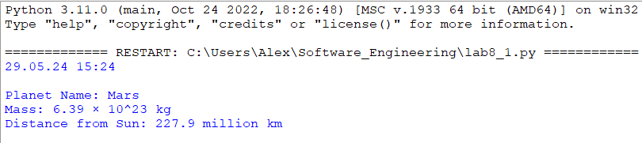
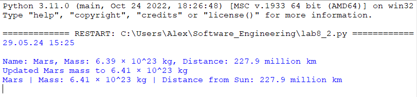
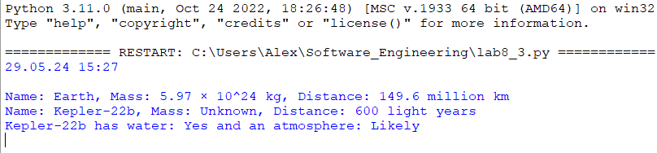
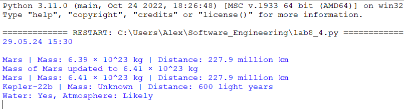

# Тема 8. Введение в ООП
Отчет по Теме #8 выполнил:
- Глазырин Александр Сергеевич
- ИНО ОЗБ ПОАС-22-1

| Задание    | Сам_раб |
|------------|---------|
| Задание 1  | +       |
| Задание 2  | +       |
| Задание 3  | +       |
| Задание 4  | +       |
| Задание 5  | +       |

знак "+" - задание выполнено; знак "-" - задание не выполнено;

Работу проверили:
- к.э.н., доцент Панов М.А.

## Самостоятельная работа №1
### Самостоятельно создайте класс и его объект. Они должны отличаться, от тех, что указаны в теоретическом материале (методичке) и лабораторных заданиях. Результатом выполнения задания будет листинг кода и получившийся вывод консоли

```python
class Planet:
    def __init__(self, name, mass, distance):
        self.name = name
        self.mass = mass
        self.distance = distance

mars = Planet("Mars", "6.39 × 10^23 kg", "227.9 million km")

print(f"Planet Name: {mars.name}")
print(f"Mass: {mars.mass}")
print(f"Distance from Sun: {mars.distance}")
```
### Результат



## Самостоятельная работа №2
### Самостоятельно создайте атрибуты и методы для ранее созданного класса. Они должны отличаться, от тех, что указаны в теоретическом материале (методичке) и лабораторных заданиях. Результатом выполнения задания будет листинг кода и получившийся вывод консоли.

```python
class Planet:
    def __init__(self, name, mass, distance):
        self.name = name
        self.mass = mass
        self.distance = distance

    def display_basic_info(self):
        print(f"Name: {self.name}, Mass: {self.mass}, Distance: {self.distance}")

    def update_mass(self, new_mass):
        self.mass = new_mass
        print(f"Updated {self.name} mass to {self.mass}")

    def format_info(self):
        return f"{self.name} | Mass: {self.mass} | Distance from Sun: {self.distance}"

mars = Planet("Mars", "6.39 × 10^23 kg", "227.9 million km")
mars.display_basic_info()
mars.update_mass("6.41 × 10^23 kg")
formatted_info = mars.format_info()
print(formatted_info)
```
### Результат


## Самостоятельная работа №3
### Самостоятельно реализуйте наследование, продолжая работать с ранее созданным классом. Оно должно отличаться, от того, что указано в теоретическом материале (методичке) и лабораторных заданиях. Результатом выполнения задания будет листинг кода и получившийся вывод консоли.


```python
class Planet:
    def __init__(self, name, mass, distance):
        self.name = name
        self.mass = mass
        self.distance = distance

    def display_basic_info(self):
        print(f"Name: {self.name}, Mass: {self.mass}, Distance: {self.distance}")

    def update_mass(self, new_mass):
        self.mass = new_mass
        print(f"Updated {self.name} mass to {self.mass}")

    def format_info(self):
        return f"{self.name} | Mass: {self.mass} | Distance from Sun: {self.distance}"

class HabitablePlanet(Planet):
    def __init__(self, name, mass, distance, water_presence, atmosphere):
        super().__init__(name, mass, distance)
        self.water_presence = water_presence
        self.atmosphere = atmosphere

    def display_habitable_features(self):
        print(f"{self.name} has water: {self.water_presence} and an atmosphere: {self.atmosphere}")

earth = Planet("Earth", "5.97 × 10^24 kg", "149.6 million km")
earth.display_basic_info()

kepler = HabitablePlanet("Kepler-22b", "Unknown", "600 light years", "Yes", "Likely")
kepler.display_basic_info()
kepler.display_habitable_features()
```
### Результат


## Самостоятельная работа №4
### Самостоятельно реализуйте инкапсуляцию, продолжая работать с ранее созданным классом. Она должна отличаться, от того, что указана в теоретическом материале (методичке) и лабораторных заданиях. Результатом выполнения задания будет листинг кода и получившийся вывод консоли.

```python
class Planet:
    def __init__(self, name, mass, distance):
        self._name = name
        self._mass = mass
        self._distance = distance

    def get_name(self):
        return self._name

    def set_mass(self, mass):
        self._mass = mass
        print(f"Mass of {self._name} updated to {self._mass}")

    def get_info(self):
        return f"{self._name} | Mass: {self._mass} | Distance: {self._distance}"

class HabitablePlanet(Planet):
    def __init__(self, name, mass, distance, water_presence, atmosphere):
        super().__init__(name, mass, distance)
        self._water_presence = water_presence
        self._atmosphere = atmosphere

    def get_habitable_features(self):
        return f"Water: {self._water_presence}, Atmosphere: {self._atmosphere}"

mars = Planet("Mars", "6.39 × 10^23 kg", "227.9 million km")
print(mars.get_info())

mars.set_mass("6.41 × 10^23 kg")
print(mars.get_info())

kepler = HabitablePlanet("Kepler-22b", "Unknown", "600 light years", "Yes", "Likely")
print(kepler.get_info())
print(kepler.get_habitable_features())

```
### Результат



## Самостоятельная работа №5
### Самостоятельно реализуйте полиморфизм. Он должен отличаться, от того, что указан в теоретическом материале (методичке) и лабораторных заданиях. Результатом выполнения задания будет листинг кода и получившийся вывод консоли.

```python
class Planet:
    def __init__(self, name, mass, distance):
        self._name = name
        self._mass = mass
        self._distance = distance

    def get_info(self):
        return f"{self._name} | Mass: {self._mass} | Distance: {self._distance}"

    def describe(self):
        return f"{self._name} is a non-habitable planet."

class HabitablePlanet(Planet):
    def __init__(self, name, mass, distance, water_presence, atmosphere):
        super().__init__(name, mass, distance)
        self._water_presence = water_presence
        self._atmosphere = atmosphere

    def get_habitable_features(self):
        return f"Water: {self._water_presence}, Atmosphere: {self._atmosphere}"

    def describe(self):
        return f"{self._name} is a potentially habitable planet with {self._water_presence} water and {self._atmosphere} atmosphere."

mars = Planet("Mars", "6.39 × 10^23 kg", "227.9 million km")
kepler = HabitablePlanet("Kepler-22b", "Unknown", "600 light years", "Yes", "Likely")

print(mars.describe())
print(kepler.describe())

```

### Результат
